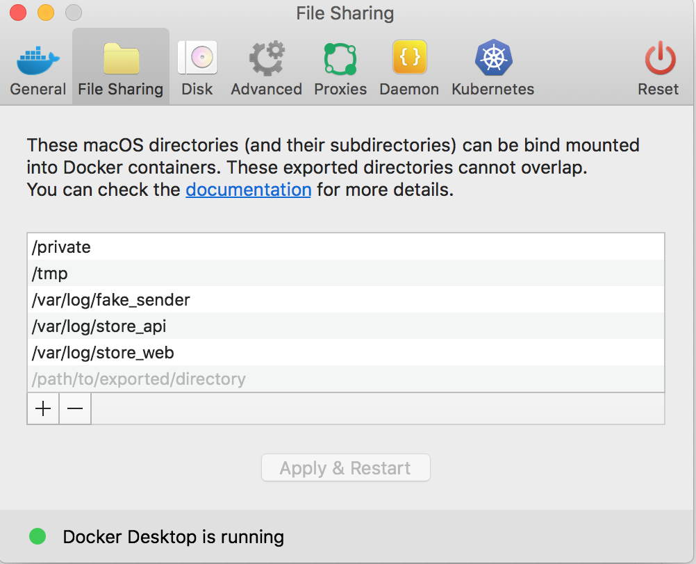

# How to develop?

Welcome to "How to develop" guide.

This page covers the setup of your development environment
#### 0. Unix machine
Make sure you are using a UNIX machine :-)
#### 1. Install docker
|Platform|Instructions|
|-|-|
|mac|[dinghy](https://github.com/codekitchen/dinghy) or  [docker-for-mac](https://github.com/codekitchen/dinghy)|
|linux|[here](https://www.digitalocean.com/community/tutorials/how-to-install-and-use-docker-on-ubuntu-18-04)|

#### 2. Install docker-compose
Installation instructions here: https://docs.docker.com/compose/install

#### 3. Configure docker volumes
If you are using `mac` and `docker for mac` - you should configure your docker volumes. Add folder with project to docker for mac :


#### 4. Ngrok
For frontend developing and scanner developing - you need to open your project via valid `https`. We use ngrok for that.

#### 5. Make
Just install make to your machine: instructions here: [mac](https://stackoverflow.com/a/38903785/2777349) / [linux](https://askubuntu.com/a/272020/811404)

#### 6. Run application
To run the project, run the following command:
```
make start-dev
```
When it's running - script will check `ngrok`. If `ngrok` is not installed - script will install it for you (just type admin password - unfortunately it require sudo).

After startup project - navigate to http://localhost:4040 and copy `ngrok url`

#### 7. Run migrations and seed initial values into DB
Simply run:
```bash
# Migrate database
make migrate-dev
# Initialise DB with test values
make db-seed
```

#### 8. Finish!
Hooray - application was started. You can look at this via `ngrok url` or http://localhost or http://your_docker_host_ip

## Scanner developing
Only via mobile and `ngrok url`
