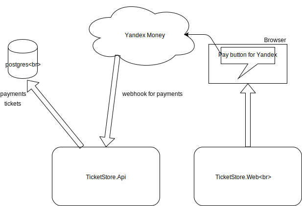

# Ticket Store (chertopolokh)
App for sell and verifying tickets

|Branch|Integration tests|Unit tests|Code coverage|
| ------------- |:-------------:|:-------------:|:-------------:|
|master||||

## How it works:

## Contributing guide
Please read ["How to develop" instructions](Docs/CONTRIBUTING.md)
